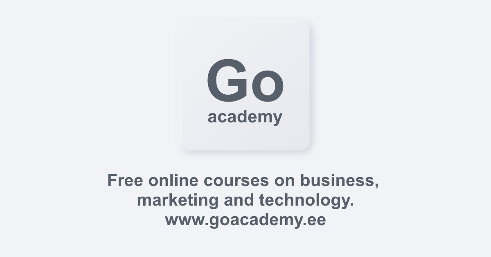

# 📜Growth Crash Course Description

This course is designed for beginners to enrich knowledge about computer and the internet. How obvious it isn’t, 90% of computer and Internet users are illiterate when it comes to a wider and deeper knowledge on how it actually works. The goal of this course is bring this stat 1% down.

This is not systematic going deep into details course. This is a roadmap, to show what can you do and what you don't know. If this sparks any initiative inside you, it has already accomplished its mission. Some parts are hectic, since the human brain needs to be injected some times different dimensions of information that the brain itself will organise later.

The main outcome of this course is to deliver knowledge, that is useful to you. Remember, useful means something you can use, to achieve your goals!

**Naz**

Co-Founder of Aligner. Data Science and Management PhD Student. Write to me at [Linkedin](https://www.linkedin.com/in/nazari-goudin-556a55165/ "Naz LinkedIn Profile").


**Registration**  
All participants must register and be a part of feedback infrastructure.\
Register here 👇


Register now

# Schedule


**First lecture**  
First lecture starts at **26.04.2020** 10:00-13:00. 


**Second lecture**  
First lecture starts at **03.05.2020** 10:00-13:00.


**Second lecture**  
First lecture starts at **10.05.2020** 10:00-13:00.


# Add it to your calendar

Import Calendar 
Google Calendar Invite 

# Prerequisites for software:

- Computer
- Google Hangouts Account
- Latest OS on any system, Mac or Windows
- Latest Chrome or Chromium-based browser
- Gmail account


Get Anaconda

Get Brave browser 

Get Chrome browser 