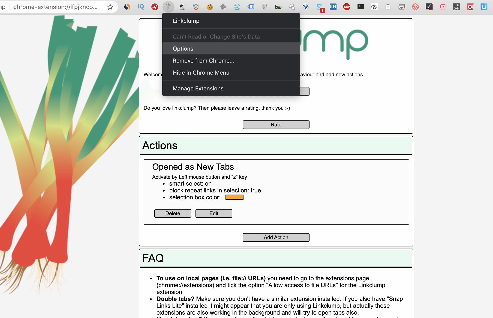
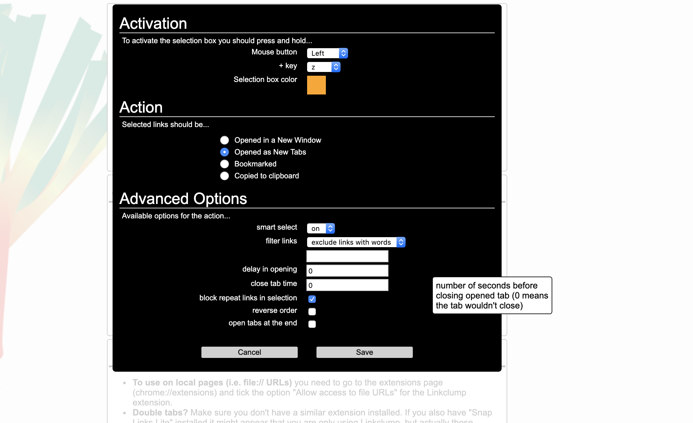
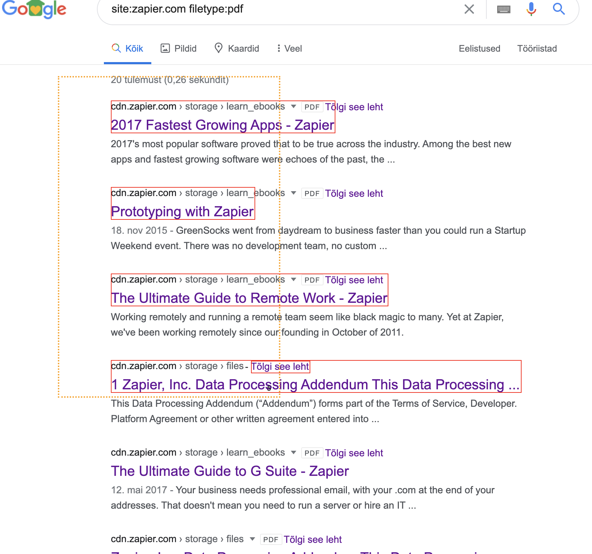
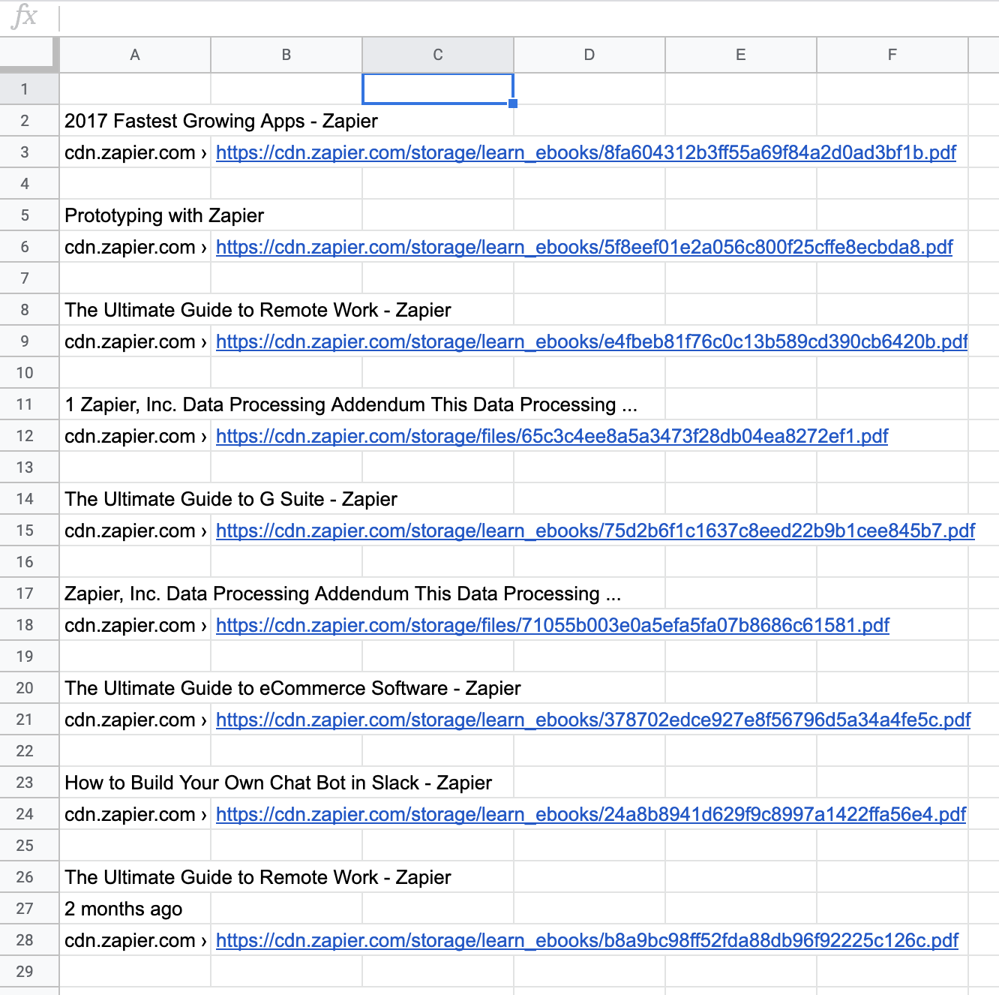
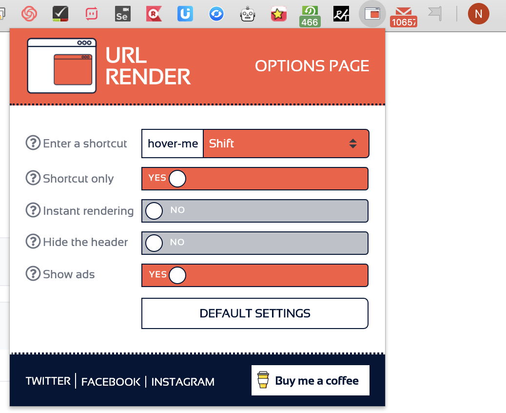
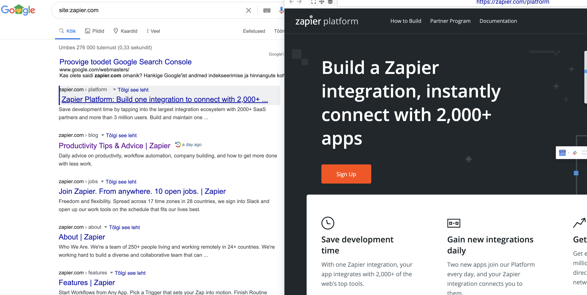

# Materials mentioned in the lecture 26-04-2020

# Extensions
Add Linklump Extension Chrome
Add URL renderer to Chrome


1. Linklump- select all links and **A:** Open in new tabs **B:** Copy to clipboard. Helpful to work with links.

## Linklump setup

## 1. Go to options

## 2. Click on edit

## 3. Choose actions 

- A: If you want to open in new windows 
- B: Open in new tabs 
- C: Bookmarked 
- C: Copied to clipboard (**used in lecture**)

## 4. press  `z+ left click and start selecting links (drag)` 

## 5. paste to Google Sheets (any destination)




# URL Renderer
URL renderer is made to reduce load of open tabs that is exhausting your computer RAM and see content without opening a new tab.

## Click on URL renderer icon

## Hover on link and hold `shift` key down. 



## Exercise file

Copy Google Sheets file with answers here
